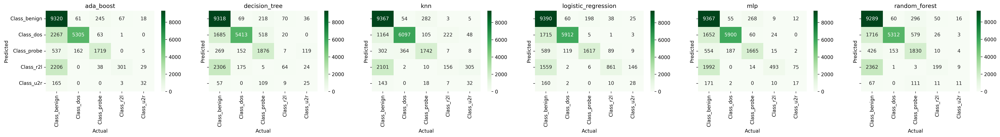

# End to End Datascience Report

- Author: Don Athalage
- Student ID: 219397418
- [GitHub](https://github.com/Kushan-Nilanga/sit719/blob/main/5.1D/writing/Report%20-%20Don%20Athalage.md)
  
<div style="page-break-after: always;"></div>

## Table of Contents
- [End to End Datascience Report](#end-to-end-datascience-report)
  - [Table of Contents](#table-of-contents)
  - [Introduction](#introduction)
  - [Problem Definition](#problem-definition)
  - [Data Exploration](#data-exploration)
  - [Feature Engineering](#feature-engineering)
  - [Model Selection](#model-selection)
    - [Hyperparameter Tuning](#hyperparameter-tuning)
      - [Parameter Grid Space](#parameter-grid-space)
      - [Best Parameters for NSL-KDD Dataset](#best-parameters-for-nsl-kdd-dataset)
      - [Best Parameters for IoT Dataset](#best-parameters-for-iot-dataset)
    - [Training](#training)
    - [Evaluations](#evaluations)
  - [Data Visualization](#data-visualization)
    - [NSL-KDD Results](#nsl-kdd-results)
      - [Confusion Matrices](#confusion-matrices)
      - [Model Performances](#model-performances)
    - [IoT Results](#iot-results)
      - [Confusion Matrices](#confusion-matrices-1)
      - [Model Performances](#model-performances-1)
  - [Conclusion](#conclusion)

<div style="page-break-after: always;"></div>

## Introduction

This report studies two datasets NSL-KDD and Processed and Combined IoT Datasets. In the future sections of this report we will use various machine learning algorithms to develop classification models to evaluate the performances of each respective machine learning algorithm and solve the undelying business problem related to the dataset. Multiple machine learning algorithms used in this report are as follows:

- Ada Boost
- Random Forest
- Decision Tree
- Logistic Regression
- K-Nearest Neighbors
- Support Vector Machine 
- Multi-Layer Perceptron 

Initially, the dataset it explored carefully to indentify the features and the target variable. The dataset is then cleaned and preprocessed to remove any missing values and outliers. The dataset is then split into training and testing sets. The training set is used to train the machine learning models and the testing set is used to evaluate the performance of the models.

Algorithms themselves are fine-tuned with Grid Search and Random Search to find the best hyperparameters for each model. About 400 different hyperparameter combinations are evaluated and each parameter combination is tested using 3-fold cross validation. 

The performance of each model will be evaluated using various metrics such as accuracy, precision, recall, F1 score, AUC and confusion matrix. The performance of each model will be compared and the best model will be selected to solve the business problem.

## Problem Definition

**NSL-KDD** dataset is a network IDS dataset to explore ways to classify the dataset. The dataset contains 5 different attack classes as below:
- `Benign`
- `DoS`
- `Probe`
- `U2R` (highly imbalanced)
- `R2L` (highly imbalanced)

The dataset is cleaned, however imbalances must be addressed. The problem is to correctly classify the attack classes. 

**Processed and Combined IoT Datasets** dataset is a IoT dataset to explore ways to classify the dataset. This dataset is also a cyber attack dataset that explores the cyber attacks on IoT Networks. This dataset has a balanced target variable. The problem is to correctly classify the attacks.

<div style="page-break-after: always;"></div>

##  Data Exploration
[Notebook Link](../code/4_explore_data.ipynb)

**KDD dataset** is plotted in histogram to indentify the distribution of the features. The following plots are generated.


Most notable observations is the class inbalance between the attack types. These must be syntetically balanced to train the models. Due to these imbalances in features and target data it is difficult to identify respective distributions.

We have converted the categorical features to numerical features using one-hot encoding. The following features are converted to numerical features.

```python
kdd_dataset['train']['data'] = pd.get_dummies(
    kdd_dataset['train']['data'], columns=['Class'], prefix='Class')
kdd_dataset['train']['data'].to_csv(
    '../artefacts/3/kdd_train.csv', index=False)

kdd_dataset['test']['data'] = pd.get_dummies(
    kdd_dataset['test']['data'], columns=['Class'], prefix='Class')
kdd_dataset['test']['data'].to_csv(
    '../artefacts/3/kdd_test.csv', index=False)
```

Furthemore, plotted correlation matrix to indentify the correlation between the features. The following plot is generated.


The correlation matrix shows that there are no features that are highly correlated. This is a good sign as it means that the features are independent of each other.

**IoT dataset** is plotted in histogram to indentify the distribution of the features. The following plots are generated.


This dataset is well balanced and some of the features show a normal distribution. Furthermoe the dataset is clean and does not contain any missing values.

We have converted the categorical features to numerical features using one-hot encoding. The following features are converted to numerical features.

```python
iot_dataset['train'] = pd.get_dummies(
    iot_dataset['train'], columns=['label'], prefix='label')
iot_dataset['train'].to_csv(
    '../artefacts/3/iot_train.csv', index=False)

iot_dataset['test'] = pd.get_dummies(
    iot_dataset['test'], columns=['label'], prefix='label')
iot_dataset['test'].to_csv(
    '../artefacts/3/iot_test.csv', index=False)
```

Furthemore, plotted correlation matrix to indentify the correlation between the features. The following plot is generated.


The correlation matrix shows that there are minimal features that are highly correlated. This is a good sign as it means that the features are independent of each other. The correlated features are not removed as they are less problematic for classification models. 

## Feature Engineering
[Notebook Link](../code/5_feature_engineering.ipynb)

**KDD dataset** has imbalance in the target variable. `Resampling` technique from `sklearn` library is used for syntetic upsampling of the minority classes. The following code is used to syntetic upsample the dataset. 

```python
def preprocess_kdd(kdd: pd.DataFrame):
    # number of rows where Class_benign is 1
    num_benign = kdd[kdd['Class_benign'] == 1].shape[0]

    # use sklearn resample to balance the dataset
    kdd_benign = kdd[kdd['Class_benign'] == 1]
    kdd_u2r = kdd[kdd['Class_u2r'] == 1]
    kdd_r2l = kdd[kdd['Class_r2l'] == 1]
    kdd_probe = kdd[kdd['Class_probe'] == 1]
    kdd_dos = kdd[kdd['Class_dos'] == 1]

    kdd_u2r = resample(kdd_u2r, replace=True, n_samples=num_benign, random_state=42)
    kdd_r2l = resample(kdd_r2l, replace=True, n_samples=num_benign, random_state=42)
    kdd_probe = resample(kdd_probe, replace=True, n_samples=num_benign, random_state=42)
    kdd_dos = resample(kdd_dos, replace=True, n_samples=num_benign, random_state=42)
    
    kdd = pd.concat([kdd_benign, kdd_u2r, kdd_r2l, kdd_probe, kdd_dos])

    return kdd
```


## Model Selection

This report analyses the performance of following models.
- Ada Boost
- Decision Tree
- K Nearest Neighbors
- Logistic Regression
- Multilayer Perceptron
- Random Forest

> Support Vector Machine is not used as it takes a long time to train the model.

Experiment is divided into hyperparameter tuning, training and evaluation.

### Hyperparameter Tuning
[Notebook Link](../code/6_predictive_modelling_1-params.ipynb)

In order to find the best possible combination of hyperparameters for each of the models and for each of the datasets, a [randomised grid search](https://scikit-learn.org/stable/modules/generated/sklearn.model_selection.RandomizedSearchCV.html) is performed. The following code is used to perform the hyperparameter tuning.

```python
def best_parameters(x_train, y_train, dataset_name):

    # create pipelines
    decision_tree = Pipeline(
        [('scaler', StandardScaler()), ('clf', DecisionTreeClassifier(random_state=random_state))])
    random_forest = Pipeline(
        [('scaler', StandardScaler()), ('clf', RandomForestClassifier(random_state=random_state))])
    knn = Pipeline(
        [('scaler', StandardScaler()), ('clf', KNeighborsClassifier())])
    logistic_regression = Pipeline(
        [('scaler', StandardScaler()), ('clf', OneVsRestClassifier(estimator=LogisticRegression(random_state=random_state)))])
    svm = Pipeline(
        [('scaler', StandardScaler()), ('clf', OneVsRestClassifier(SVC(random_state=random_state)))])
    mlp = Pipeline(
        [('scaler', StandardScaler()), ('clf', MLPClassifier(random_state=random_state))])
    ada_boost = Pipeline(
        [('scaler', StandardScaler()), ('clf', OneVsRestClassifier(AdaBoostClassifier(random_state=random_state)))])

    pipeline_grids = [
        ("decision_tree", decision_tree, decision_tree_param_grid),
        ("random_forest", random_forest, random_forest_param_grid),
        ("knn", knn, knn_param_grid),
        ("logistic_regression", logistic_regression, logistic_regression_param_grid),
        ("mlp", mlp, mlp_param_grid),
        ("ada_boost", ada_boost, ada_boost_param_grid),
        ("svm", svm, svm_param_grid),
    ]

    best_params = []

    """open dataset resuls file and append results"""
    try:
        results = json.open(
            f"../artefacts/6/results_{dataset_name}.json")
    except:
        results = {}

    for model_name, pipeline, grid in pipeline_grids:
        try:
            start = time.time()

            grid_search = RandomizedSearchCV(
                pipeline,
                grid,
                scoring='roc_auc',
                n_jobs=-1,
                cv=3,
                n_iter=400)

            grid_search.fit(x_train, y_train)

            best_param = {'model': model_name,
                          'best_parameters': grid_search.best_params_,
                          'best_score': grid_search.best_score_}

            with open("../artefacts/6/params_{}_{}.json".format(dataset_name, model_name), 'w') as f:
                json.dump(best_param, f)

            best_params.append(best_param)
            print(best_param)

            end = time.time()

            results[model_name] = {
                "params": {
                    "score": grid_search.best_score_,
                    "time": end - start
                }
            }

            # save results
            with open(f'../artefacts/6/results_{dataset_name}.json', 'w+') as f:
                json.dump(results, f, indent=4)

        except Exception as e:
            print("error with model: ", model_name, " - ", e)

    return best_params

```
[roc_auc score](https://scikit-learn.org/stable/modules/generated/sklearn.metrics.roc_auc_score.html) is used as the scoring metric for the hyperparameter tuning. The best parameters for each of the models are saved in a json file. Furthermore, best scores, time taken also saved in a json file. 400 different random iterations are followed to indentify the best parameter combination for each of the models. 

#### Parameter Grid Space


**Decision Tree**\
Decision Tree model is a supervised learning algorithm that is used for both classification and regression problems. It is a tree-like graph of decisions and their possible consequences, including chance event outcomes, resource costs, and utility. Decision tree aims to create a model that predicts the value of a target variable by learning simple decision rules inferred from the data. The below grid space is used for hyperparameter tuning<sup>[1]</sup>.

- [1] Sun, S. and Iwaihara, M., Finding Member Articles for Wikipedia Lists.


<pre>decision_tree_param_grid = {
    'clf__criterion': ['gini', 'entropy'],
    'clf__max_depth': [None, 2, 3, 4, 5, 6, 7, 8, 9, 10],
    'clf__min_samples_split': [2, 3, 4, 5, 6, 7, 8, 9, 10],
    'clf__min_samples_leaf': [1, 2, 3, 4, 5, 6, 7, 8, 9, 10],
    'clf__max_features': [None, 'sqrt', 'log2'],
    'clf__class_weight': [None, 'balanced']
}</pre>

Details of each of these parameters can be found in the [sklearn documentation](https://scikit-learn.org/stable/modules/generated/sklearn.tree.DecisionTreeClassifier.html).

**Random Forest**\
Random Forest use multiple decision trees and output the class that is the mode of the classes (classification) or mean prediction (regression) of the individual trees. The below grid space is used for hyperparameter tuning.

<pre>random_forest_param_grid = {
    'clf__n_estimators': [10, 20, 30, 40, 50, 60, 70, 80, 90, 100],
    'clf__criterion': ['gini', 'entropy'],
    'clf__max_depth': [None, 2, 3, 4, 5, 6, 7, 8, 9, 10],
    'clf__min_samples_split': [2, 3, 4, 5, 6, 7, 8, 9, 10],
    'clf__min_samples_leaf': [1, 2, 3, 4, 5, 6, 7, 8, 9, 10],
    'clf__max_features': [None, 'sqrt', 'log2'],
    'clf__class_weight': [None, 'balanced']
}</pre>

Details of each of these parameters can be found in the [sklearn documentation](https://scikit-learn.org/stable/modules/generated/sklearn.ensemble.RandomForestClassifier.html).


**KNN**\
K nearest neighbors is a simple yet effective algorithm used to classify data classes. KNN work by finding the k nearest neighbors to a data point, and then using these datapoints to classify the class that is most common among its k nearest neighbors. The below grid space is used for hyperparameter tuning.

<pre>knn_param_grid = {
    'clf__n_neighbors': [1, 2, 3, 4, 5, 6, 7, 8, 9, 10],
    'clf__weights': ['uniform', 'distance'],
    'clf__algorithm': ['auto', 'ball_tree', 'kd_tree', 'brute'],
    'clf__leaf_size': [10, 20, 30, 40, 50, 60, 70, 80, 90, 100],
    'clf__p': [1, 2]
}</pre>
Details of each of these parameters can be found in the [sklearn documentation](https://scikit-learn.org/stable/modules/generated/sklearn.neighbors.KNeighborsClassifier.html).


**Logistic Regression**\
Logistic regression is a statistical model that in its basic form uses a logistic function (sigmoid) to model a binary dependent variable, although many more complex extensions exist<sup>[2]</sup>. Below is the grid space used for hyperparameter tuning.

- [2] Guo, G., Wang, H., Bell, D., Bi, Y. and Greer, K., 2003, November. KNN model-based approach in classification. In OTM Confederated International Conferences" On the Move to Meaningful Internet Systems" (pp. 986-996). Springer, Berlin, Heidelberg.

<pre>logistic_regression_param_grid = {
    'clf__estimator__penalty': ['l2'],
    'clf__estimator__C': [0.001, 0.01, 0.1, 1, 10, 100, 1000],
    'clf__estimator__class_weight': [None, 'balanced']
}</pre>
Details of each of these parameters can be found in the [sklearn documentation](https://scikit-learn.org/stable/modules/generated/sklearn.linear_model.LogisticRegression.html).

**SVM**\
Support vector machines are supervised classification models that attempt to find a hyperplane that separates the data into classes. These hyperplanes are found by fitting different function to the dataset and then picking the one that satisfies to gain the best performance. We can use OneVsRestClassifier to train a separate classifier for each class. Below is the grid space used for hyperparameter tuning.

<pre>svm_param_grid = {
    'clf__estimator__C': [0.001, 0.01, 0.1, 1, 10, 100, 1000],
    'clf__estimator__kernel': ['linear', 'poly', 'rbf', 'sigmoid'],
    'clf__estimator__degree': [1, 2, 3, 4, 5, 6, 7, 8, 9, 10],
    'clf__estimator__gamma': ['auto', 'scale'],
    'clf__estimator__class_weight': [None, 'balanced']
}</pre>

Details of each of these parameters can be found in the [sklearn documentation](https://scikit-learn.org/stable/modules/generated/sklearn.svm.SVC.html).

**MLP**\
MLP is a supervised learning algorithm that learns a function f(x) by training on a dataset, where x is the input and y is the output. Given a set of features and a target, it can learn a function approximator for either classification or regression. MLP has evolved on to becoming deep learning domain of machine learning. Below is the grid space used for hyperparameter tuning.

<pre>mlp_param_grid = {
    'clf__hidden_layer_sizes': [(10,), (20,), (30,), (40,), (50,), (60,), (70,), (80,), (90,), (100,)],
    'clf__activation': ['identity', 'logistic', 'tanh', 'relu'],
    'clf__solver': ['lbfgs', 'sgd', 'adam'],
    'clf__alpha': [0.0001, 0.001, 0.01, 0.1, 1, 10, 100],
    'clf__learning_rate': ['constant', 'invscaling', 'adaptive'],
    'clf__learning_rate_init': [0.0001, 0.001, 0.01, 0.1, 1, 10, 100],
    'clf__power_t': [0.1, 0.2, 0.3, 0.4, 0.5, 0.6, 0.7, 0.8, 0.9, 1],
    'clf__max_iter': [100, 200, 300, 400, 500, 600, 700, 800, 900, 1000],
    'clf__shuffle': [True, False],
    'clf__random_state': [random_state],
    'clf__tol': [0.0001, 0.001, 0.01, 0.1, 1, 10, 100],
    'clf__verbose': [False],
    'clf__warm_start': [True, False],
    'clf__momentum': [0.1, 0.2, 0.3, 0.4, 0.5, 0.6, 0.7, 0.8, 0.9, 1],
    'clf__nesterovs_momentum': [True, False],
    'clf__early_stopping': [True, False],
    'clf__validation_fraction': [0.1, 0.2, 0.3, 0.4, 0.5, 0.6, 0.7, 0.8, 0.9, 1],
    'clf__beta_1': [0.1, 0.2, 0.3, 0.4, 0.5, 0.6, 0.7, 0.8, 0.9, 1],
    'clf__beta_2': [0.1, 0.2, 0.3, 0.4, 0.5, 0.6, 0.7, 0.8, 0.9, 1],
    'clf__epsilon': [0.1, 0.2, 0.3, 0.4, 0.5, 0.6, 0.7, 0.8, 0.9, 1],
    'clf__n_iter_no_change': [1, 2, 3, 4, 5, 6, 7, 8, 9, 10]
}</pre>

Details of each of these parameters can be found in the [sklearn documentation](https://scikit-learn.org/stable/modules/generated/sklearn.neural_network.MLPClassifier.html).


**Ada Boost**\
AdaBoost is a machine learning meta-algorithm originally proposed by Yoav Freund and Robert Schapire in 1995. AdaBoost is short for Adaptive Boosting. AdaBoost is a boosting algorithm that can be used to convert a set of weak learners into a strong learner. Below is the grid space used for hyperparameter tuning.

<pre>ada_boost_param_grid = {
    'clf__estimator__n_estimators': [10, 20, 30, 40, 50, 60, 70, 80, 90, 100],
    'clf__estimator__learning_rate': [0.001, 0.01, 0.1, 1, 10, 100, 1000],
    'clf__estimator__algorithm': ['SAMME', 'SAMME.R']
}</pre>

Details of each of these parameters can be found in the [sklearn documentation](https://scikit-learn.org/stable/modules/generated/sklearn.ensemble.AdaBoostClassifier.html).

#### Best Parameters for NSL-KDD Dataset

The above hyperparameters grid was used to identify the best combination for each of the algorithms. RandomizedSearchCV was used to find the best combination of hyperparameters for each of the algorithms instead of GridSearchCV. This is because the number of combinations for each of the algorithms is very large and GridSearchCV would take a very long time to run. The best combination of hyperparameters for each of the algorithms is shown below.

**Decision Tree**\
As there were more than 400 possible parameter combinations for decision tree the best parameter combination only gave best score of 0.979 for the same training dataset. However this is sufficient for the purpose of training the on the complete training dataset. 
<pre>{
    "model": "decision_tree",
    "best_parameters": {
        "clf__min_samples_split": 2,
        "clf__min_samples_leaf": 8,
        "clf__max_features": null,
        "clf__max_depth": 10,
        "clf__criterion": "entropy",
        "clf__class_weight": "balanced"
    },
    "best_score": 0.97934931981061
}</pre>

**Random Forest**\
Random forest use multiple decision trees to create the best performing algorithms and we can se there are parameters similar to decision tree present in the random forest. 
<pre>{
    "model": "random_forest",
    "best_parameters": {
        "clf__n_estimators": 70,
        "clf__min_samples_split": 3,
        "clf__min_samples_leaf": 1,
        "clf__max_features": null,
        "clf__max_depth": 10,
        "clf__criterion": "gini",
        "clf__class_weight": null
    },
    "best_score": 0.9978399513443873
}</pre>

**Ada Boost**\
Adaptive Boosting is a boosting algorithm that can be used to convert a set of weak learners into a strong learner. This also uses decision trees as base learners. Ada boost improves on the base learners. 
<pre>{
    "model": "ada_boost",
    "best_parameters": {
        "clf__estimator__n_estimators": 60,
        "clf__estimator__learning_rate": 1,
        "clf__estimator__algorithm": "SAMME"
    },
    "best_score": 0.9945092945392845
}</pre>

**K-Nearest Neighbours**\
KNN was also had relatively lower best score compared to other algorithms. However this is sufficient for the purpose of training the on the complete training dataset.
<pre>{
    "model": "knn",
    "best_parameters": {
        "clf__weights": "distance",
        "clf__p": 1,
        "clf__n_neighbors": 8,
        "clf__leaf_size": 30,
        "clf__algorithm": "auto"
    },
    "best_score": 0.9885581466095035
}</pre>

**Logistic Regression**\
Logistic regression is a classification algorithm that is used to predict the probability of a categorical dependent variable. This was performed with `OneVsRestClassifier` to perform multiclass classification.
<pre>{
    "model": "logistic_regression",
    "best_parameters": {
        "clf__estimator__penalty": "l2",
        "clf__estimator__class_weight": null,
        "clf__estimator__C": 0.1
    },
    "best_score": 0.9881815560223064
}</pre>

**Multi-Layer Perceptron**\
Multi-layer Preceptron had the largest search space and majority of the search iterations were cut short due to iteration limits. However the best score was still 0.991.
<pre>{
    "model": "mlp",
    "best_parameters": {
        "clf__warm_start": false,
        "clf__verbose": false,
        "clf__validation_fraction": 0.7,
        "clf__tol": 1,
        "clf__solver": "adam",
        "clf__shuffle": true,
        "clf__random_state": 719,
        "clf__power_t": 1,
        "clf__nesterovs_momentum": false,
        "clf__n_iter_no_change": 4,
        "clf__momentum": 0.4,
        "clf__max_iter": 500,
        "clf__learning_rate_init": 10,
        "clf__learning_rate": "constant",
        "clf__hidden_layer_sizes": [50],
        "clf__epsilon": 0.9,
        "clf__early_stopping": false,
        "clf__beta_2": 0.9,
        "clf__beta_1": 0.6,
        "clf__alpha": 0.0001,
        "clf__activation": "logistic"
    },
    "best_score": 0.9908936461151671
}</pre>

#### Best Parameters for IoT Dataset
All of the models were not able to identify parameter combination that would achieve a score of 0.99 or above due to smaller size of the dataset and limited number of features. The best parameter combination for each of the algorithms is shown below.

**Ada Boost**\
<pre>{
    "model": "ada_boost",
    "best_parameters": {
        "clf__estimator__n_estimators": 60,
        "clf__estimator__learning_rate": 1,
        "clf__estimator__algorithm": "SAMME.R"
    },
    "best_score": 0.8290336347085097
}</pre>

**Decision Tree**\
<pre>{
    "model": "decision_tree",
    "best_parameters": {
        "clf__min_samples_split": 9,
        "clf__min_samples_leaf": 8,
        "clf__max_features": null,
        "clf__max_depth": null,
        "clf__criterion": "entropy",
        "clf__class_weight": "balanced"
    },
    "best_score": 0.8198514665681581
}</pre>

**K-Nearest Neighbours**\
<pre>{
    "model": "knn",
    "best_parameters": {
        "clf__weights": "distance",
        "clf__p": 1,
        "clf__n_neighbors": 10,
        "clf__leaf_size": 80,
        "clf__algorithm": "kd_tree"
    },
    "best_score": 0.8342415513132817
}</pre>

**Logistic Regression**\
Logistic Regression had the lowest performance from parameter tuning. Possible reasons for this is due to changing the binary variable to categorical variable and the limited number of features. The binary variable was changed to categorical variable to allow the use of `OneVsRestClassifier` to perform multiclass classification. This was done to bring the consistency between the datasets. 
<pre>{
    "model": "logistic_regression",
    "best_parameters": {
        "clf__estimator__penalty": "l2",
        "clf__estimator__class_weight": "balanced",
        "clf__estimator__C": 0.001
    },
    "best_score": 0.68471591414446
}</pre>

**Multi-Layer Perceptron**\
<pre>{
    "model": "mlp",
    "best_parameters": {
        "clf__warm_start": false,
        "clf__verbose": false,
        "clf__validation_fraction": 0.2,
        "clf__tol": 0.0001,
        "clf__solver": "lbfgs",
        "clf__shuffle": true,
        "clf__random_state": 719,
        "clf__power_t": 0.1,
        "clf__nesterovs_momentum": false,
        "clf__n_iter_no_change": 1,
        "clf__momentum": 1,
        "clf__max_iter": 200,
        "clf__learning_rate_init": 10,
        "clf__learning_rate": "constant",
        "clf__hidden_layer_sizes": [20],
        "clf__epsilon": 0.3,
        "clf__early_stopping": false,
        "clf__beta_2": 0.4,
        "clf__beta_1": 0.9,
        "clf__alpha": 1,
        "clf__activation": "relu"
    },
    "best_score": 0.8242067998609883
}</pre>

**Random Forest**\
<pre>{
    "model": "random_forest",
    "best_parameters": {
        "clf__n_estimators": 70,
        "clf__min_samples_split": 8,
        "clf__min_samples_leaf": 8,
        "clf__max_features": null,
        "clf__max_depth": null,
        "clf__criterion": "gini",
        "clf__class_weight": "balanced"
    },
    "best_score": 0.8348806401371366
}</pre>

### Training
[Notebook Link](../code/6_predictive_modelling_2-training.ipynb)

By applying the results of the parameter tuning, the models were trained with the respective complete datasets. The models are then saved to hard drive for evaluation in the next step. Initially sklearn pipelines are used to create a machine learning pipeline where data is transformed using the `StandardScaler` and then fed into the respective machine learning algorithm. Please refer to the respective github notebooks for the code used to create the pipelines. Furthermore, the best parameters that were saved in previous step is also loaded along with dataset and the pipeline to create the machine learning architecture. Finally the training results and timings are saved to the hard drive for visualisation.

```python 
def train_and_save(pipelines, dataset_name, x, y):
    try:
        results = load_json(
            f'../artefacts/6/results_{dataset_name}.json')
    except:
        results = {}

    for model_name, params, pipeline in pipelines:
        start = time.time()
        print(f"Training {model_name}", end=' -> ')
        pipeline.set_params(**params.get('best_parameters'))
        pipeline.fit(x, y)
        print(f"Saving {model_name}", end=' -> ')
        score = pipeline.score(x.iloc[:10000], y.iloc[:10000])
        print(f"Score: {score}")
        joblib.dump(
            pipeline, f'../artefacts/6/models_{dataset_name}_{model_name}.joblib')
        end = time.time()

        try:
            results[model_name]['train'] = {
                'time': end - start,
                'score': score
            }
        except:
            results[model_name] = {
                'train': {
                    'time': end - start,
                    'score': score
                }
            }

        with open(f'../artefacts/6/results_{dataset_name}.json', 'w+') as f:
            json.dump(results, f, indent=4)
```

### Evaluations
[Notebook Link](../code/6_predictive_modelling_3-testing.ipynb)

The models saved to disc is loaded again with the respective test datasets. The models are then evaluated using the test datasets and the results are saved to hard drive for visualisation. We are creating the confusion matrices in this step to visualise the model performances for each of the model. The confusion matrices are saved to hard drive for visualisation. The confusion matrices are also used to calculate the F1 score, accuracy, precision and recall. The results are saved to hard drive for visualisation.

```python
def test_dataset(prefix, x, y, y_labels):
    figure, axis = plt.subplots(1, 6, figsize=(5 * 7, 3), sharey=True)

    # set plot resolution
    plt.rcParams['figure.dpi'] = 300

    try:
        results = load_json(
            f'../artefacts/6/results_{prefix}.json')
    except:
        results = {}

    for i, model_name in enumerate(models):
        start = time.time()
        f1, accuracy, precision, recall = 0, 0, 0, 0

        # open model joblib file
        try:
            model = joblib.load(
                f'../artefacts/6/models_{prefix}_{model_name}.joblib')
        except:
            print(f'Error loading model {model_name}')
            continue
        else:

            y_pred = model.predict(x)

            con_mat = confusion_matrix(y.values.argmax(
                axis=1), y_pred.argmax(axis=1))

            # convert confusion matrix to dataframe
            con_mat_df = pd.DataFrame(
                con_mat, index=y_labels, columns=y_labels)

            sns.heatmap(con_mat_df, annot=True, fmt='g',
                        ax=axis[i], cmap='Greens')

            # f1 score from sklearn
            f1 = f1_score(y.values.argmax(axis=1),
                          y_pred.argmax(axis=1), average='weighted')

            # accuracy score from sklearn
            accuracy = accuracy_score(
                y.values.argmax(axis=1), y_pred.argmax(axis=1))

            # precision score from sklearn
            precision = precision_score(y.values.argmax(
                axis=1), y_pred.argmax(axis=1), average='weighted')

            # recall score from sklearn
            recall = recall_score(y.values.argmax(
                axis=1), y_pred.argmax(axis=1), average='weighted')
        end = time.time()

        try:
            results[model_name]['test'] = {
                'f1': f1,
                'accuracy': accuracy,
                'precision': precision,
                'recall': recall,
                'time': end - start
            }
        except:
            results[model_name] = {
                'test': {
                    'f1': f1,
                    'accuracy': accuracy,
                    'precision': precision,
                    'recall': recall,
                    'time': end - start
                }
            }

        # save results to json file
        with open(f'../artefacts/6/results_{prefix}.json', 'w+') as f:
            json.dump(results, f, indent=4)

        axis[i].set_title(f'{model_name}')
        axis[i].set_xlabel('Actual')
        axis[i].set_ylabel('Predicted')

    plt.show()
    return results
```

## Data Visualization
[Notebook Link](../code/7_data_visualisation.ipynb)

During the previous steps data about model performances, tuning times, training times and evaluation times have been gathere. The results data is saved to a json file. These results are plotted as heatmaps to identify the best performing models. The confusion matrices are also plotted to visualise the model performances.

### NSL-KDD Results

#### Confusion Matrices
Outputs from the validation phase was used to plot confusion matrices. All of the models perform similarly with some notable observations.

- Majority of the predicted `u2r` attacks are actually `benign`.
- Some of the predicted `dos` attacks are actually `benign`.

Possible reasons for this situation would be that we are upsampling `dos`, `u2r`, `l2r` and `probe` attacks. This means that the model is learning to predict `benign` more than the other attack types. This is a possible reason for the model predicting `benign` more than the other attack types.


> Greener the colour, higher values in the confusion matrix.

This confusion matrix suggest the classification results of each of the models are promising. However, inorder to understand the complete picture of the model performances, we need to look at the model performances.

#### Model Performances
Results from each of the end to end project steps have been plotted as a heat map in this section. These metrics include,
- Hyperparameter tuning
  - Score - `roc_auc`
  - Time
- Training
  - Score - `roc_auc`
  - Time
- Evaluation
  - F1 Score
  - Accuracy
  - Precision
  - Recall
  - Time

These metrics will allow us to apply the machine learning models appropriately to specific scenarios. For example, if we are looking for a model that can be used in real time, we can choose a model that has a low training time and evaluation time. If we are looking for a model that can be used in a batch processing environment, we can choose a model that has a high training time and evaluation time. 


This diagram provides a good overview of the model performances. The following observations can be made from the diagram,
- Logistic Regression has performed the best in terms of F1 score, accuracy, precision and recall. It also had a relatively lower training time compared to other models.
- KNN model is potentially overfitted as the training score is 1.0 and the test score is 0.9999. This model also took a long time to train and evaluate.
- KNN test training times are significantly higher compared to other models. 
- *Logistic Regression is the overall best model in terms of F1 score, accuracy, precision and recall. It also had a relatively lower training time compared to other models.*

> ⚠︎ SVM results shown are not acurate as the model took too long to train and evaluate and was terminated before completion.
> 
> KNN `test.score` is shown as 1 however this is due to rounding off actual value is closer to 0.9999. This model is potentially overfitted. 

### IoT Results
Similar to NSL-KDD results, confusion matrices and model performances are plotted for IoT dataset.

#### Confusion Matrices
Since this is also a multi-class classification problem, confusion matrices are plotted to visualise the model performances. The following observations can be made from the confusion matrices. Although the models perform similarly, there are some notable observations.
- Logistic regression has done significantly worse in classification of the dataset compared to other models.
- Adaboost and Multilayer has also done significantly worse in classification of the dataset compared to other models.
- Random Forest and Decision Tree have performed the best in classification of the dataset.


#### Model Performances
Results from each of the end to end project steps have been plotted as a heat map in this section. 


- KNN algorithm had the best F1 score, accuracy, precision and recall. However, it took a long time to evaluate.
- MLP and Decision Tree has comparable F1 scores, accuracy, precision and recall. However, MLP took a long time to train.
- Logistic Regression has the worst F1 score, accuracy, precision and recall. However, it took a relatively shorter time to train and evaluate.

> SVM Models have not been included in the results as they took too long to train and evaluate.

## Conclusion

We have thoroughly analysed the NSL-KDD and IoT datasets. We have also applied machine learning models to the datasets and evaluated the model performances. The following observations can be made from the analysis,
- The NSL-KDD dataset is a multi-class classification problem with 5 attack types. The dataset is imbalanced with `benign` attacks being the majority class. The best performing model was Logistic Regression with an F1 score of 0.7795.
- IoT dataset is a multi-class classification problem with 2 classes. The best performing model was KNN with an F1 score of 0.8695.