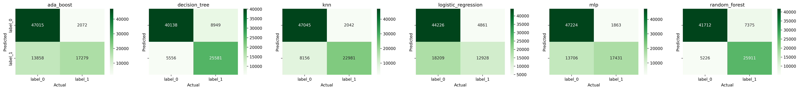

# End to End Datascience Report

- Author: Don Athalage
- Student ID: 219397418
- [GitHub](https://github.com/Kushan-Nilanga/sit719/blob/main/5.1D/writing/Report%20-%20Don%20Athalage.md)
  
<div style="page-break-after: always;"></div>

## Table of Contents
- [End to End Datascience Report](#end-to-end-datascience-report)
  - [Table of Contents](#table-of-contents)
  - [Introduction](#introduction)
  - [Problem Definition](#problem-definition)
  - [Data Exploration](#data-exploration)
  - [Feature Engineering](#feature-engineering)
  - [Model Selection](#model-selection)
    - [Hyperparameter Tuning](#hyperparameter-tuning)
    - [Training](#training)
    - [Evaluations](#evaluations)
  - [Data Visualization](#data-visualization)
  - [Conclusion](#conclusion)

<div style="page-break-after: always;"></div>

## Introduction

This report studies two datasets NSL-KDD and Processed and Combined IoT Datasets. In the future sections of this report we will use various machine learning algorithms to develop classification models to evaluate the performances of each respective machine learning algorithm and solve the undelying business problem related to the dataset. Multiple machine learning algorithms used in this report are as follows:

- Ada Boost
- Random Forest
- Decision Tree
- Logistic Regression
- K-Nearest Neighbors
- Support Vector Machine 
- Multi-Layer Perceptron 

Initially, the dataset it explored carefully to indentify the features and the target variable. The dataset is then cleaned and preprocessed to remove any missing values and outliers. The dataset is then split into training and testing sets. The training set is used to train the machine learning models and the testing set is used to evaluate the performance of the models.

Algorithms themselves are fine-tuned with Grid Search and Random Search to find the best hyperparameters for each model. About 400 different hyperparameter combinations are evaluated and each parameter combination is tested using 3-fold cross validation. 

The performance of each model will be evaluated using various metrics such as accuracy, precision, recall, F1 score, AUC and confusion matrix. The performance of each model will be compared and the best model will be selected to solve the business problem.

## Problem Definition

**NSL-KDD** dataset is a network IDS dataset to explore ways to classify the dataset. The dataset contains 5 different attack classes as below:
- `Benign`
- `DoS`
- `Probe`
- `U2R` (highly imbalanced)
- `R2L` (highly imbalanced)

The dataset is cleaned, however imbalances must be addressed. The problem is to correctly classify the attack classes. 

**Processed and Combined IoT Datasets** dataset is a IoT dataset to explore ways to classify the dataset. This dataset is also a cyber attack dataset that explores the cyber attacks on IoT Networks. This dataset has a balanced target variable. The problem is to correctly classify the attacks.

<div style="page-break-after: always;"></div>

##  Data Exploration
[Notebook Link](../code/4_explore_data.ipynb)

**KDD dataset** is plotted in histogram to indentify the distribution of the features. The following plots are generated.


Most notable observations is the class inbalance between the attack types. These must be syntetically balanced to train the models. Due to these imbalances in features and target data it is difficult to identify respective distributions.

We have converted the categorical features to numerical features using one-hot encoding. The following features are converted to numerical features.

```python
kdd_dataset['train']['data'] = pd.get_dummies(
    kdd_dataset['train']['data'], columns=['Class'], prefix='Class')
kdd_dataset['train']['data'].to_csv(
    '../artefacts/3/kdd_train.csv', index=False)

kdd_dataset['test']['data'] = pd.get_dummies(
    kdd_dataset['test']['data'], columns=['Class'], prefix='Class')
kdd_dataset['test']['data'].to_csv(
    '../artefacts/3/kdd_test.csv', index=False)
```

Furthemore, plotted correlation matrix to indentify the correlation between the features. The following plot is generated.


The correlation matrix shows that there are no features that are highly correlated. This is a good sign as it means that the features are independent of each other.

**IoT dataset** is plotted in histogram to indentify the distribution of the features. The following plots are generated.


This dataset is well balanced and some of the features show a normal distribution. Furthermoe the dataset is clean and does not contain any missing values.

We have converted the categorical features to numerical features using one-hot encoding. The following features are converted to numerical features.

```python
iot_dataset['train'] = pd.get_dummies(
    iot_dataset['train'], columns=['label'], prefix='label')
iot_dataset['train'].to_csv(
    '../artefacts/3/iot_train.csv', index=False)

iot_dataset['test'] = pd.get_dummies(
    iot_dataset['test'], columns=['label'], prefix='label')
iot_dataset['test'].to_csv(
    '../artefacts/3/iot_test.csv', index=False)
```

Furthemore, plotted correlation matrix to indentify the correlation between the features. The following plot is generated.


The correlation matrix shows that there are minimal features that are highly correlated. This is a good sign as it means that the features are independent of each other. The correlated features are not removed as they are less problematic for classification models. 

## Feature Engineering
[Notebook Link](../code/5_feature_engineering.ipynb)

**KDD dataset** has imbalance in the target variable. `Resampling` technique from `sklearn` library is used for syntetic upsampling of the minority classes. The following code is used to syntetic upsample the dataset. 

```python
def preprocess_kdd(kdd: pd.DataFrame):
    # number of rows where Class_benign is 1
    num_benign = kdd[kdd['Class_benign'] == 1].shape[0]

    # use sklearn resample to balance the dataset
    kdd_benign = kdd[kdd['Class_benign'] == 1]
    kdd_u2r = kdd[kdd['Class_u2r'] == 1]
    kdd_r2l = kdd[kdd['Class_r2l'] == 1]
    kdd_probe = kdd[kdd['Class_probe'] == 1]
    kdd_dos = kdd[kdd['Class_dos'] == 1]

    kdd_u2r = resample(kdd_u2r, replace=True, n_samples=num_benign, random_state=42)
    kdd_r2l = resample(kdd_r2l, replace=True, n_samples=num_benign, random_state=42)
    kdd_probe = resample(kdd_probe, replace=True, n_samples=num_benign, random_state=42)
    kdd_dos = resample(kdd_dos, replace=True, n_samples=num_benign, random_state=42)
    
    kdd = pd.concat([kdd_benign, kdd_u2r, kdd_r2l, kdd_probe, kdd_dos])

    return kdd
```


## Model Selection

This report analyses the performance of following models.
**Ada Boost**
**Decision Tree**
**K Nearest Neighbors**
**Logistic Regression**
**Multilayer Perceptron**
**Random Forest**

> Support Vector Machine is not used as it takes a long time to train the model.

Experiment is divided into hyperparameter tuning, training and evaluation. The following notebooks are used for the experiment.

### Hyperparameter Tuning
[Notebook Link](../code/6_predictive_modelling_1-params.ipynb)
### Training
[Notebook Link](../code/6_predictive_modelling_2-training.ipynb)
### Evaluations
[Notebook Link](../code/6_predictive_modelling_3-testing.ipynb)


## Data Visualization
[Notebook Link](../code/7_data_visualisation.ipynb)





## Conclusion